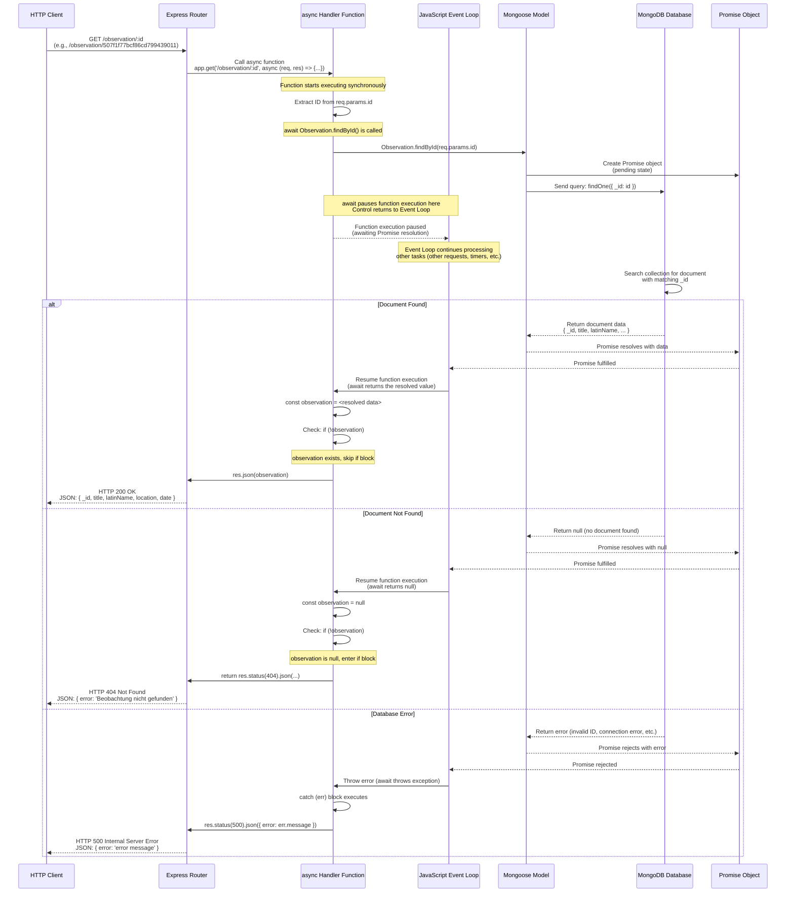

# Async/Await Flow Diagram: GET /observation/:id

This diagram shows how async/await works in detail for the `GET /observation/:id` endpoint.



## Key Concepts Explained

### 1. **Async Function Declaration**
```javascript
app.get('/observation/:id', async (req, res) => {
```
- The `async` keyword makes the function return a Promise automatically
- Allows use of `await` inside the function

### 2. **Await Pauses Execution**
```javascript
const observation = await Observation.findById(req.params.id);
```
- `await` pauses the function execution at this line
- Control returns to the Event Loop (allows other code to run)
- Function execution resumes when the Promise resolves/rejects

### 3. **Promise Lifecycle**
- **Pending**: Promise is created, operation in progress
- **Fulfilled**: Operation succeeded, Promise resolves with value
- **Rejected**: Operation failed, Promise rejects with error

### 4. **Event Loop Behavior**
- While waiting for the database, JavaScript can process other requests
- This is why Node.js can handle many concurrent requests efficiently
- When Promise resolves, the function resumes from where it paused

### 5. **Error Handling**
- If Promise rejects, `await` throws an exception
- `try/catch` block catches the exception
- Error response is sent to client

## Comparison: Without Async/Await

**Without async/await (callback style):**
```javascript
app.get('/observation/:id', (req, res) => {
    Observation.findById(req.params.id, (err, observation) => {
        if (err) {
            return res.status(500).json({ error: err.message });
        }
        if (!observation) {
            return res.status(404).json({ error: 'Not found' });
        }
        res.json(observation);
    });
});
```

**With async/await (current style):**
```javascript
app.get('/observation/:id', async (req, res) => {
    try {
        const observation = await Observation.findById(req.params.id);
        if (!observation) {
            return res.status(404).json({ error: 'Not found' });
        }
        res.json(observation);
    } catch (err) {
        res.status(500).json({ error: err.message });
    }
});
```

**Benefits of async/await:**
- More readable (looks like synchronous code)
- Easier error handling (try/catch instead of nested callbacks)
- Better debugging (stack traces are clearer)
