# Modal.js Flow Diagram

This diagram shows the complete flow of the `modal.js` file, including the event listener setup, form validation, data collection, and AJAX request.

## Detailed Sequence Diagram

```mermaid
sequenceDiagram
    participant Page as HTML Page
    participant Script as modal.js
    participant User as User
    participant Form as Form Element
    participant jQuery as jQuery
    participant Express as Express Server
    participant MongoDB as MongoDB

    Page->>Script: Page loads, script executes
    Script->>Script: $(document).ready()
    Script->>jQuery: Setup event listener<br/>$('#saveObservation').on('click')
    
    Note over Script: Waiting for user interaction
    
    User->>Page: Clicks "Beobachtung hinzufügen" button
    Page->>Script: Click event triggered
    Script->>Script: preventDefault()<br/>Stop default form behavior
    
    Script->>Form: form.checkValidity()
    
    alt Form Invalid
        Form-->>Script: Returns false
        Script->>Form: form.reportValidity()
        Form-->>User: Shows validation errors
        Script-->>User: User must fix errors
    else Form Valid
        Form-->>Script: Returns true
        Script->>jQuery: $('#title').val()
        jQuery-->>Script: Title value
        Script->>jQuery: $('#latinname').val()
        jQuery-->>Script: Latin name value
        Script->>jQuery: $('#observation-location').val()
        jQuery-->>Script: Location value
        Script->>jQuery: $('#date').val()
        jQuery-->>Script: Date value
        
        Script->>Script: Create formData object<br/>{title, latinName, location, date}
        Script->>Script: JSON.stringify(formData)
        
        Script->>Express: $.ajax POST /observation<br/>Content-Type: application/json
        Express->>MongoDB: Save observation
        MongoDB-->>Express: Document saved
        
        alt Success
            Express-->>Script: HTTP 201 Created<br/>JSON response
            Script->>jQuery: $('#observationModal').modal('hide')
            Script->>Form: form.reset()
            Script->>User: alert('Success!')
        else Error
            Express-->>Script: HTTP 400/500 Error<br/>JSON error message
            Script->>User: alert('Error: ...')
        end
    end
```

## Code Structure Breakdown

### 1. **Initialization Phase**
- Script loads when page loads
- `$(document).ready()` ensures DOM is ready
- Event listener is set up

### 2. **User Interaction Phase**
- User clicks button
- Event handler function executes
- Default behavior is prevented

### 3. **Validation Phase**
- Form validation check
- If invalid: show errors, stop
- If valid: continue

### 4. **Data Collection Phase**
- Collect all form field values
- Create JavaScript object
- Convert to JSON string

### 5. **Server Communication Phase**
- Send AJAX POST request
- Wait for server response
- Handle success or error

### 6. **Response Handling Phase**
- Success: Close modal, reset form, show message
- Error: Show error message to user
