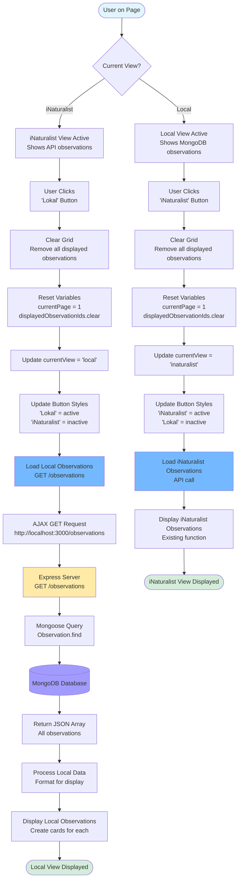
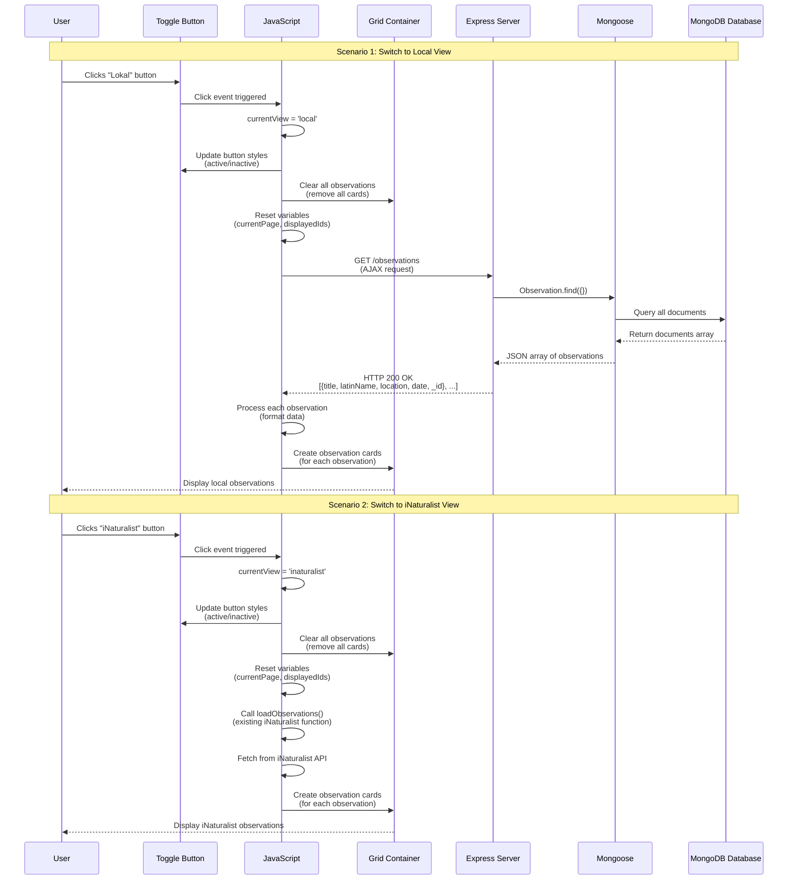

# Toggle Between Local and iNaturalist Views - Flow Diagram

This diagram shows how the toggle functionality works to switch between local MongoDB observations and iNaturalist API observations.



## Detailed Sequence Diagram



## Code Structure Breakdown

### 1. **Global State Management**
```javascript
let currentView = 'inaturalist'; // Track which view is active
```

### 2. **Toggle Button Event Listeners**
```javascript
$('#view-local').on('click', function() {
    // Switch to local view
    currentView = 'local';
    clearGrid();
    loadLocalObservations();
});

$('#view-inaturalist').on('click', function() {
    // Switch to iNaturalist view
    currentView = 'inaturalist';
    clearGrid();
    loadObservations(1, true);
});
```

### 3. **Clear Grid Function**
```javascript
function clearGrid() {
    // Remove all observation cards
    // Reset variables
    // Update button styles
}
```

### 4. **Load Local Observations Function**
```javascript
function loadLocalObservations() {
    $.ajax({
        url: 'http://localhost:3000/observations',
        type: 'GET',
        success: function(observations) {
            displayLocalObservations(observations);
        }
    });
}
```

### 5. **Display Local Observations Function**
```javascript
function displayLocalObservations(observations) {
    // For each observation:
    // - Create card element
    // - Fill with data (title, latinName, location, date)
    // - Add to grid
    // Note: Local observations don't have photos
}
```

## Key Differences: Local vs iNaturalist

| Feature | Local (MongoDB) | iNaturalist (API) |
|---------|----------------|-------------------|
| **Data Source** | Express Server → MongoDB | iNaturalist API |
| **Endpoint** | `GET /observations` | `GET https://api.inaturalist.org/v1/observations` |
| **Data Format** | `{title, latinName, location, date, _id}` | `{taxon, photos, observed_on, place_guess, id}` |
| **Photos** | ❌ No photos | ✅ Has photos |
| **Pagination** | ❌ Load all at once | ✅ Pagination (6 per page) |
| **Filtering** | ❌ Not needed | ✅ Filter for valid observations |

## Implementation Steps

1. **Add global variable** to track current view
2. **Add event listeners** for toggle buttons
3. **Create clearGrid()** function to reset display
4. **Create loadLocalObservations()** function to fetch from Express
5. **Create displayLocalObservations()** function to show MongoDB data
6. **Update button styles** when switching views
7. **Handle empty state** (no local observations yet)
