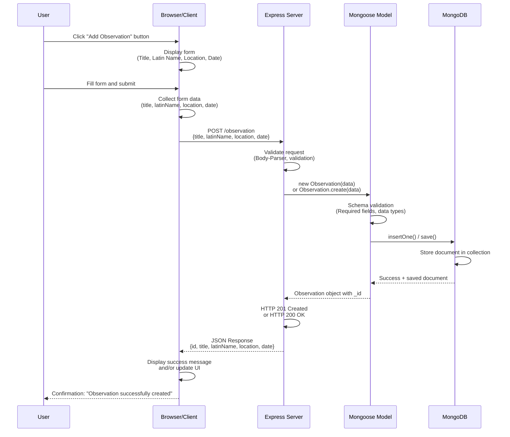

# Sequence Diagram: Creating an Observation

```mermaid
sequenceDiagram
    participant User as User
    participant Browser as Browser/Client
    participant Express as Express Server
    participant Mongoose as Mongoose Model
    participant MongoDB as MongoDB

    User->>Browser: Click "Add Observation" button
    Browser->>Browser: Display form<br/>(Title, Latin Name, Location, Date)
    User->>Browser: Fill form and submit
    Browser->>Browser: Collect form data<br/>(title, latinName, location, date)
    Browser->>Express: POST /observation<br/>{title, latinName, location, date}
    Express->>Express: Validate request<br/>(Body-Parser, validation)
    Express->>Mongoose: new Observation(data)<br/>or Observation.create(data)
    Mongoose->>Mongoose: Schema validation<br/>(Required fields, data types)
    Mongoose->>MongoDB: insertOne() / save()
    MongoDB->>MongoDB: Store document in collection
    MongoDB-->>Mongoose: Success + saved document
    Mongoose-->>Express: Observation object with _id
    Express->>Express: HTTP 201 Created<br/>or HTTP 200 OK
    Express-->>Browser: JSON Response<br/>{id, title, latinName, location, date}
    Browser->>Browser: Display success message<br/>and/or update UI
    Browser-->>User: Confirmation: "Observation successfully created"
```
